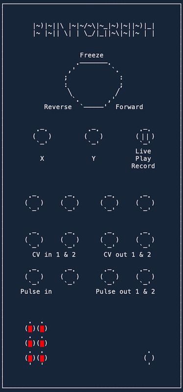

# Pantograph

Trace and record CV — record knob movements, loop them at bipolar speed. A program
card for the [Music Thing Workshop System Computer](https://www.musicthing.co.uk/workshopsystem/).

Pantograph lets you trace a performance on the X and Y knobs (e.g. oscillator pitch
and filter cutoff), record it, then loop it back out the two CV outputs at variable
speeds.

Switch **UP** auditions live; hold **DOWN** to record (monitored, so you hear it as
you play); release to **MIDDLE** and it loops exactly that length. The Main knob sets
playback speed: centre = freeze, left = reverse, right = faster.

Patch a gate into **Pulse In 1** and MIDDLE becomes a triggered envelope; unpatched it
free-loops. **Pulse Out 1** fires a trigger at the end of a recording. **Pulse Out 2**
runs a gate from the shape of the recording.



## Controls

### Switch

| Position | Mode | What it does |
|---|---|---|
| **Up** | Live | Audition — X/Y play live to the CV outs, CV-in summed on top |
| **Middle** | Play | Loop the recorded trace at Main-knob speed; X/Y knobs attenuate each trace |
| **Down** (hold) | Record | Hold to record a fresh trace; release to Middle to loop it |

### Knobs

| Knob | Name | What it does |
|---|---|---|
| **Main** | Speed | Playback speed, bipolar — centre = freeze, left = reverse, right = faster |
| **X** | Trace X | Performance value in Live/Record; playback depth (attenuation) in Play |
| **Y** | Trace Y | Performance value in Live/Record; playback depth (attenuation) in Play |

## Inputs & outputs

### Inputs

| Jack | Name | What it does |
|---|---|---|
| **CV In 1** | X Mod | Live CV summed onto the CV 1 output |
| **CV In 2** | Y Mod | Live CV summed onto the CV 2 output |
| **Pulse In 1** | Trigger | When patched, Play (Middle) becomes a one-shot: each rising edge retriggers. Unpatched = loop |

*(Pulse In 2 and both Audio Inputs are unused.)*

### Outputs

| Jack | Name | What it does |
|---|---|---|
| **CV Out 1** | Trace X CV | Trace X playback |
| **CV Out 2** | Trace Y CV | Trace Y playback |
| **Pulse Out 1** | End of Cycle | Trigger on every trace wraparound |
| **Pulse Out 2** | Contour Gate | Gates high on Trace X's recorded shape |

*(Both Audio Outputs are unused.)*

## LEDs

- **Live:** two 3-LED level bars (brightness = |output| per X/Y).
- **Record:** buffer-fill gauge (LEDs fill 1→6 as the recording approaches the ~75 s cap).
- **Play:** a moving position dot — reverses and freezes with speed, and holds on the
  last LED when a trigger finishes.

## Repository layout

| File | Purpose |
|---|---|
| `pantograph.h` | Pure signal logic — integer/fixed-point math, no Pico headers, host-testable |
| `pantograph.cpp` | ComputerCard glue — the RP2040 firmware entry point |
| `tests/` | doctest host tests for the pure logic (fast, no hardware) |
| `CMakeLists.txt`, `pico_sdk_import.cmake` | Firmware build |
| `ComputerCard.h` | Vendored [ComputerCard](https://github.com/TomWhitwell/Workshop_Computer/tree/main/Demonstrations%2BHelloWorlds/ComputerCard) framework header |
| `.clang-format` | Formatting config (enforced by a pre-commit hook) |

The design keeps everything the card *computes* in `pantograph.h` as plain integer
math (the RP2040 has no FPU), so it can be developed and tested entirely on the host;
`pantograph.cpp` is a thin layer that wires that logic to the ComputerCard I/O.

## Development

Build the firmware (Raspberry Pi Pico SDK, C++17):

```sh
cmake -S . -B build -DPICO_SDK_PATH=/path/to/pico-sdk
cmake --build build --target pantograph -j4
```

Flash the resulting `build/pantograph.uf2` by holding the Computer's boot button while
connecting USB (it mounts as `RPI-RP2`), then copy the `.uf2` onto it.

Run the host tests:

```sh
cd tests && make
```

Formatting is enforced by a `clang-format` **pre-commit hook** (skips the vendored
`ComputerCard.h` and `doctest.h`): if a staged source isn't clean it's reformatted in
place and the commit aborts so you can review and re-stage.

## Releasing

The card ships in the Workshop System program-card catalogue at
[`TomWhitwell/Workshop_Computer`](https://github.com/TomWhitwell/Workshop_Computer)
under `releases/90_Pantograph/` (with `info.yaml` metadata; the `tests/` are dev-only
and not part of the release).

## Thanks

Written by Kenny Shen ([@qoelet](https://github.com/qoelet)).

- [Tom Whitwell](https://github.com/TomWhitwell) for the Music Thing Workshop System.
- Chris Johnson for ComputerCard.
